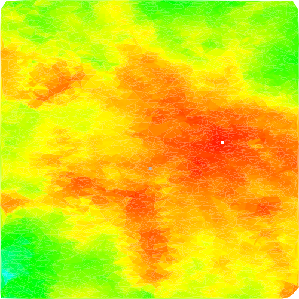

# Travel Times.

A few weeks ago, walking through the sunshine on my lunchbreak, and feeling the wanderlust of an office dweller, I wondered where I could get to within an hour. I remembered seeing a heatmap of travel durations that somebody had created, and wondered what it would look like for my current position.

And then, carried away with the omnipotence of the modern web, I started to think about how to create such an image. Google expose travel times as part of their Distance API, so I'd have to crawl this service for points in the area, then render a heatmap of these points.

I filed away the idea with all of the other interesting projects in my head that require an impossible luxury of time, but somehow this one kept knawing, and a few evenings of coding later, I had the following repository.

## Crawling for Data

The first step was to crawl the Google API for data. This is simple, but time consuming as I really don't want to exceed the rate limit and get myself blocked. I'm currently searching for random points in a bounding box- with enough points, this will offer an acceptable result, but I could extend it to a Voronoi map that partitions a little more judiciously. Another issue that could be addressed better is that the travel-time data varies with time (as trains and buses leave etc.) so ideally I'd factor that in. With random points, and collecting over time, this will average itself out, but again, this could be done better. Anyway, I have data.

## Geojson

My initial plan was just to render the data to geojson and rely on github's rendering with leaflet.js to render the output, but it seems that it clumps the points together which isn't the result I'm after. Nevermind, I'll write a renderer.

## Rendering as contours

The simplest rendering of the data would be a nearest neighbor rasterising, but this didn't really feel like what I was after. I wanted some sort of visualisation of the thresholds of time. Drawing contours on the time-dimension seemed like a nicer solution.

The typical solution for drawing contours is an algorithm called marching squares, but this requires a square mesh. I looked into methods of tesselation, and the simplest way to generate this was to use a Delauney Triangulation to generate the triangles. This wouldn't generate the even squares needed for the Marching Squares algorithm, but I reasoned that the random distribution of points meant that I could simply use the 'Meandering Triangles' variation of the algorithm directly on the mesh.

